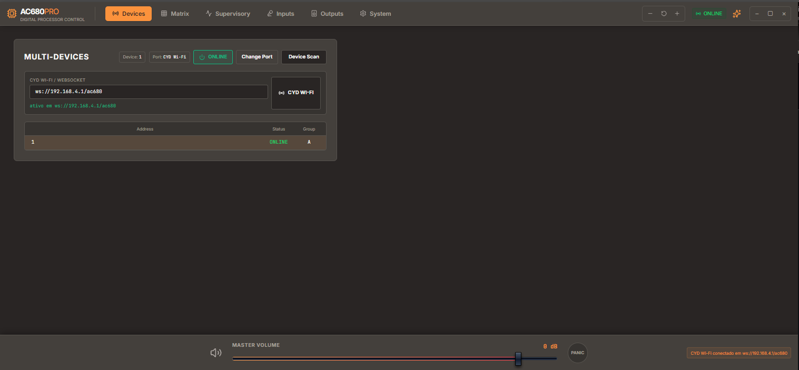
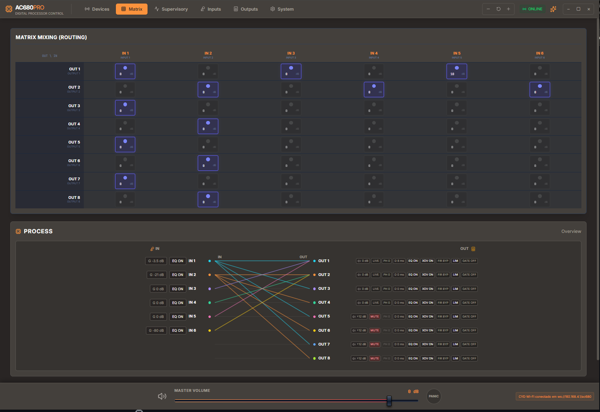
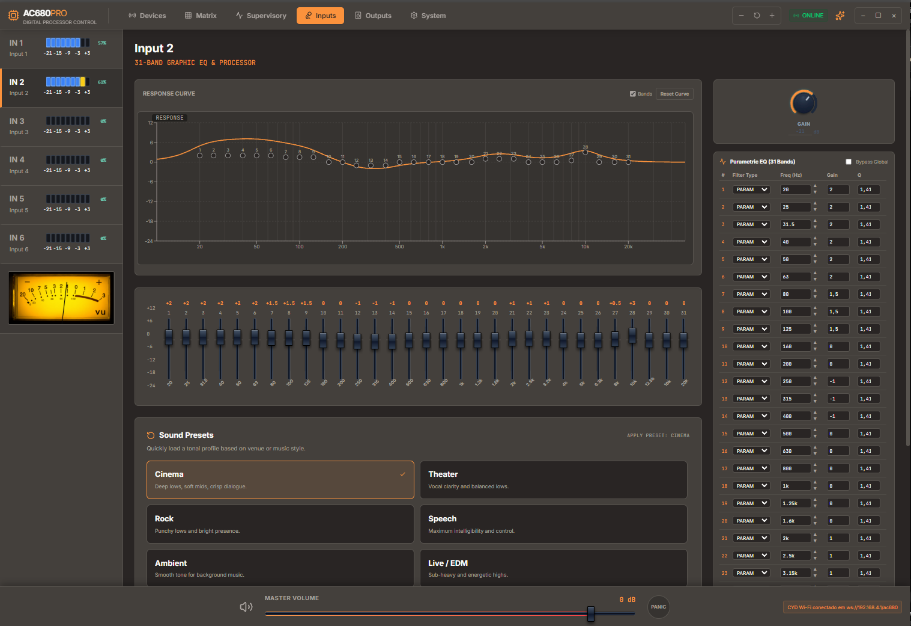
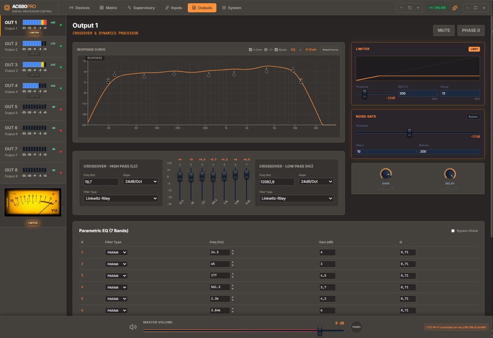
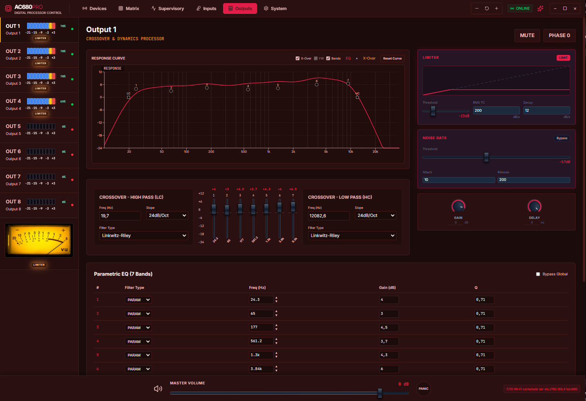
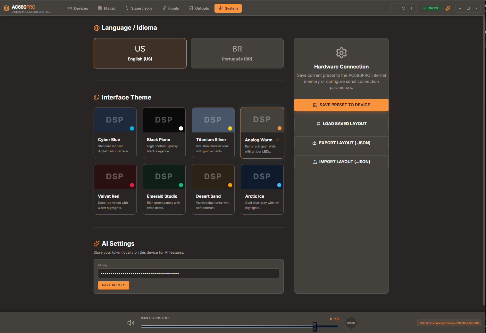

# AC680PRO DSP Controller

O **AC680PRO DSP Controller** é um sistema de controle para processadores de áudio digitais baseados em **ESP32-CYD** integrado ao **ADAU1452**, com interface moderna em desktop/web, comunicação Wi-Fi ou serial, controle em tempo real de parâmetros DSP e visualização de níveis de áudio.

O projeto combina firmware ESP-IDF, export SigmaStudio e frontend React/Electron em uma solução única para controle, calibração e operação de áudio multicanal.

## Galeria

### Dispositivos



### Matriz



### Entradas



### Saídas



### Saídas com tema vermelho



### Sistema



## Recursos principais

- Controle completo via interface gráfica.
- Comunicação com o DSP por **Wi-Fi/WebSocket** ou **Serial**.
- Matriz de roteamento **6 entradas x 8 saídas**.
- Controle de ganho individual de entradas e saídas com ajuste fracionário.
- Mute e inversão de fase.
- EQ gráfico/paramétrico de entrada com até **31 bandas**.
- EQ de saída com **7 bandas**.
- Crossover por canal de saída.
- Limiter por canal de saída com indicação visual de atuação.
- Delay de saída em canais suportados.
- VUs digitais em LED e VUs analógicos calibrados.
- Supervisor visual com widgets, conexões e monitoramento.
- Presets de áudio e layout.
- Salvamento/carregamento de configuração.
- Interface desktop empacotável em `.exe`.
- Temas visuais e suporte a idioma PT/EN.
- Assistente de IA integrado por API key.

## Controle de áudio

O sistema permite controlar os principais blocos de processamento do ADAU1452 diretamente pela interface:

- Volume master.
- Ganho de entrada.
- Ganho de saída.
- Mute por canal.
- Inversão de fase.
- Matriz de roteamento.
- Ganhos individuais dos crosspoints da matriz.
- EQ de entrada.
- EQ de saída.
- Crossover HP/LP.
- Limiter.
- Delay de saída.

Os comandos são enviados diretamente ao firmware, que atualiza os parâmetros do ADAU1452 usando os endereços exportados pelo SigmaStudio.

## Matriz 6x8

A matriz permite rotear até **6 entradas** para **8 saídas**, com controle individual de:

- Ativo/inativo por ponto de matriz.
- Ganho por crosspoint.
- Visualização clara de entradas e saídas.
- Sincronização com o firmware.

Esse recurso permite configurações flexíveis de roteamento para sistemas estéreo, multivias, subwoofers, zonas independentes ou setups personalizados.

## Equalizadores

### Entradas

Cada entrada suportada possui EQ de até **31 bandas**, com controle de:

- Frequência.
- Ganho.
- Q.
- Tipo de filtro.
- Bypass.
- Presets tonais.

### Saídas

As saídas suportadas possuem EQ dedicado de **7 bandas**, permitindo ajustes finos por via ou por zona.

## Crossover

Os canais de saída suportados possuem crossover com controles de:

- High-pass.
- Low-pass.
- Frequência.
- Tipo de filtro.
- Inclinação.
- Bypass/ativação.

Esse recurso permite uso em sistemas multivias, separação de subwoofer, alinhamento de faixas e proteção de alto-falantes.

## Limiter

O sistema possui controle de limiter nos canais de saída suportados, com ajuste de:

- Threshold.
- RMS TC.
- Decay/Release.

Além do controle, o firmware lê os readbacks de atuação do limiter exportados pelo SigmaStudio. A interface mostra a indicação visual quando o limiter está atuando.

A leitura do limiter utiliza o mesmo fluxo dos VUs, sem polling separado.

## Delay de saída

Os canais de saída suportados possuem delay ajustável, útil para alinhamento temporal entre:

- Subwoofer e vias principais.
- Drivers em sistemas multivias.
- Caixas fisicamente desalinhadas.
- Pontos de escuta diferentes.

O delay é aplicado no ADAU1452 em amostras, convertido a partir do valor em milissegundos na interface.

## VUs e calibração

O sistema possui VUs digitais em LED e VUs analógicos.

A leitura dos VUs vem dos blocos RTA/RMS do SigmaStudio, enviada pelo firmware ao frontend com valor percentual e também em **dB x10**, permitindo maior precisão visual.

A calibração segue a relação:

```text
VU = RTA_dB + 18
```

Referência usada:

```text
RTA -38 dB -> -20 VU
RTA -28 dB -> -10 VU
RTA -21 dB ->  -3 VU
RTA -18 dB ->   0 VU
RTA -15 dB ->  +3 VU
```

Os VUs analógicos usam imagem dedicada de alta qualidade e interpolação para melhor leitura visual.

## Supervisor visual

O modo Supervisor permite criar uma tela operacional personalizada com:

- Widgets de VU.
- Knobs.
- Speakers.
- Schematic blocks.
- Audio player.
- Bargraph.
- Display de 7 segmentos.
- Pontos de conexão.
- Links visuais.
- Snap/grid.
- Edição de layout.
- Exportação/importação de layout.

Esse modo permite montar uma visão gráfica do sistema de áudio, útil para operação, demonstração e monitoramento.

## Presets e persistência

O sistema possui suporte a:

- Salvamento local de presets.
- Carregamento automático de layout.
- Exportação/importação de layout `.json`.
- Salvamento de parâmetros no dispositivo.
- Aplicação automática de preset ao conectar.

O layout validado pode ser empacotado junto com o aplicativo Electron para iniciar a aplicação com uma configuração padrão.

## Comunicação

O sistema suporta dois modos principais de comunicação:

- **CYD Wi-Fi / WebSocket**
- **Serial / Web Serial / Electron Serial**

O modo Wi-Fi permite uso sem cabo USB após o dispositivo estar na rede correta. O modo Serial permite configuração direta, gravação e testes locais.

## Aplicativo desktop

O frontend pode ser empacotado como aplicativo Windows usando Electron.

Recursos do aplicativo:

- Janela sem moldura customizada.
- Botões de minimizar, maximizar/restaurar e fechar.
- Ícone próprio do AC680PRO.
- Build release normal, sem limitação trial.
- Layout padrão incluído no pacote.
- Saída em instalador `.exe`.

Comando de build:

```powershell
cd F:\Projetos\ESP32-CYD-ADAU1452\dsp-controller
npm run electron:build
```

## Interface

A interface foi construída para uso técnico e operacional, com foco em:

- Densidade de informação.
- Controles diretos.
- Leitura rápida.
- Temas visuais.
- Idiomas PT/EN.
- Operação em desktop.
- Compatibilidade com uso em campo.

## Assistente de IA

O sistema possui área para configuração de API key e uso de assistente de IA integrado. Esse recurso pode ser usado para apoio, diagnóstico, explicações e auxílio operacional, dependendo do provedor configurado.

## Estado atual

Até este ponto, o sistema já integra:

- Firmware ESP32-CYD.
- DSP ADAU1452.
- Export SigmaStudio atualizado.
- Frontend React.
- Aplicativo Electron.
- Comunicação Wi-Fi/Serial.
- Matriz, EQs, crossover, limiter, delay e VUs.
- Readback de limiter.
- Calibração documentada de VUs.
- Release desktop normal.

A próxima evolução planejada é a função experimental de **canais vinculados**, onde comandos aplicados a um canal poderão ser replicados automaticamente para outros canais selecionados, inicialmente apenas no frontend.
